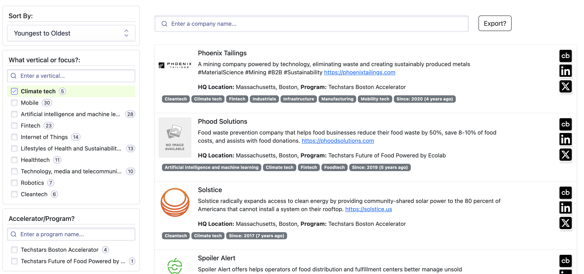

# AI Powered Tools & Services
This is a searchable UI for all the different AI powered goodness that have 
sprung singe the 2022 launch of ChatGPT from OpenAI.

### POC Tech Stack
This POC uses Algolia Search, with their Reach InstantSearch SDK. 

- Render.com (Hosts the React App)
- Algolia hosts the facetted search index.
- Github hosts the codebase and base index configurations.

## Get started
To run this project locally, install the dependencies and run the local server:

```sh
npm install
npm start
```

